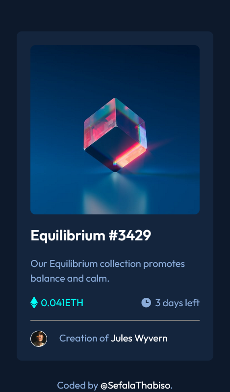
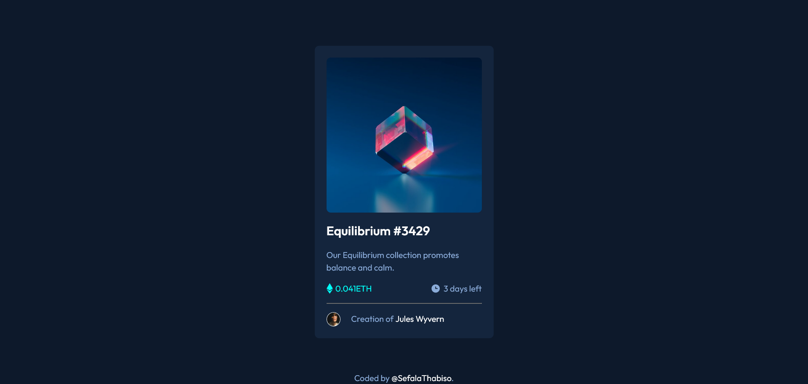

# Frontend Mentor - NFT preview card component solution

This is a solution to the [NFT preview card component challenge on Frontend Mentor](https://www.frontendmentor.io/challenges/nft-preview-card-component-SbdUL_w0U). Frontend Mentor challenges help you improve your coding skills by building realistic projects.

## Table of contents

- [Overview](#overview)
  - [The challenge](#the-challenge)
  - [Screenshot](#screenshot)
  - [Links](#links)
- [My process](#my-process)
  - [Built with](#built-with)
  - [What I learned](#what-i-learned)=
- [Author](#author)

## Overview

### The challenge

Users should be able to:

- View the optimal layout depending on their device's screen size
- See hover states for interactive elements

### Screenshot





### Links

- Solution URL: [Add solution URL here](https://your-solution-url.com)
- Live Site URL: [Add live site URL here](https://your-live-site-url.com)

## My process

### Built with

- Semantic HTML5 markup
- CSS custom properties
- Flexbox
- CSS Grid

**Note: These are just examples. Delete this note and replace the list above with your own choices**

### What I learned

I learned to use overlay icon

To see how you can add code snippets, see below:

```html
<picture>
  
  <div class="overlay">
    
  </div>
</picture>
```

```css
.overlay {
  display: flex;
  justify-content: center;
  align-items: center;
  position: absolute;
  top: 0;
  bottom: 0;
  left: 0;
  right: 0;
  width: 100%;
  opacity: 0;
  transition: 0.3s ease;
  background-color: var(--crl-primary-200);
}

.overlay__icon {
  max-width: 40px;
  max-height: 40px;
  color: var(--crl-neutral-100);
}
```

## Author

- Frontend Mentor - [@sefalathabiso](https://www.frontendmentor.io/profile/SefalaThabiso)
